# Lab1 练习 1 与练习 2：截图说明和实验记录

本说明依据成员手工操作保存的 12 张截图、3 份 GDB 日志及仓库源码整理，材料检查日期为 2026-10-10。原始材料来自仓库外的 Lab1前置准备/record_Lab1/；这里的图片与日志均原样复制，便于小组整理报告和审阅实验结果。

本次练习的主线是：了解汇编入口如何准备 C 函数的运行环境，并用 GDB 验证模拟 CPU 从复位入口经过 OpenSBI 进入内核的过程。

## 1. 材料检查结果

全部 12 张图片已逐张查看，图片中的关键地址、指令和比较结果与成功日志一致。实验副本与仓库中对应的 21 个源码及构建文件逐字节相同；实际 ELF 符号也与截图中的入口和栈地址相符。

| 文件 | 实际内容 | 可以支持的报告结论 |
|---|---|---|
| [exercise1-1.png](images/exercise1-1.png) | 入口源码、启动栈定义和四个宏 | 栈大小为 8 KiB，起始地址按 4 KiB 对齐 |
| [exercise1-2.png](images/exercise1-2.png) | make 状态、ELF 符号及入口反汇编 | 当前镜像已是最新；源码伪指令与机器指令的对应关系 |
| [exercise1-3.png](images/exercise1-3.png) | GDB 连接、内核入口断点、初始 PC/SP/RA | 入口第一条指令执行前的寄存器基线 |
| [exercise1-4.png](images/exercise1-4.png) | 执行两条机器指令后的 SP 与栈顶比较 | la 完成后 SP 等于 bootstacktop |
| [exercise1-5.png](images/exercise1-5.png) | 尾跳转后的 PC、函数地址及 RA 比较 | 已进入 kern_init，RA 没有被尾跳转改写 |
| [exercise1-6.png](images/exercise1-6.png) | 两个终端并排，固件信息、GDB 过程及内核横幅 | 内核继续执行后产生实际控制台输出 |
| [exercise2-1.png](images/exercise2-1.png) | 初始 PC/SP、六条复位指令、跳板数据及内核入口字 | CPU 从 0x1000 开始；运行前入口指令已存在 |
| [exercise2-2.png](images/exercise2-2.png) | 观察点设置、五次单步及启动参数 | 跳转前 t0 已准备好固件入口地址 |
| [exercise2-3.png](images/exercise2-3.png) | 执行 jr 后的 PC 和固件入口指令 | 复位跳板成功进入 OpenSBI |
| [exercise2-4.png](images/exercise2-4.png) | 条件断点、mret、mepc、mstatus 及 MPP 表达式 | 固件已准备内核入口和 S 模式交接状态 |
| [exercise2-5.png](images/exercise2-5.png) | mret 后的内核入口、指令字及断点统计 | 固件交接成功，入口观察点未捕获数值变化 |
| [exercise2-6.png](images/exercise2-6.png) | 固件基址、下一阶段地址与模式 | 串口信息与 GDB 交接结果相互印证 |

exercise2-4.png 中完整的 mstatus 解码在行末存在显示截断，但原始寄存器值、MPP:1 和表达式结果 0x1 均可辨认；[成功日志](logs/exercise2-reset-gdb.log)提供完整解码。现有图片足以支持两次练习的核心结论。

日志用途如下：

- [gdb.log](logs/gdb.log)：练习 1 的入口、栈设置、尾跳转和最终循环记录。
- [exercise2-reset-gdb.log](logs/exercise2-reset-gdb.log)：练习 2 正确从复位状态开始的完整观察记录。
- [exercise2-gdb.log](logs/diagnostics/exercise2-gdb.log)：先前会话从 0x8020003a 的内核循环处开始的排查记录，仅用于说明为什么需要重新启动 QEMU。

[evidence-manifest.json](evidence-manifest.json)记录 15 份原始材料的大小及 SHA-256、对应源码哈希和本次实验镜像的哈希；图片未裁剪、重绘或改写。

## 2. 本次实验环境和地址范围

| 项目 | 本次配置与依据 |
|---|---|
| 实验源码 | 仓库 lab1；截图操作在与它对应文件一致的本机实验副本中进行 |
| 目标架构 | RV64；ELF64、小端 RISC-V，截图 1-2 和 1-3 可见 |
| RISC-V GCC | 整理时核对为 14.2.0 |
| QEMU | 整理时核对为 10.2.1；virt 平台 |
| GDB | 17.1；截图 1-3 与当前版本查询一致 |
| 固件 | 本机启动包装器为旧式 loader 启动方式选择 OpenSBI FW_JUMP |
| SBI 接口版本 | 固件输出 Runtime SBI Version 为 3.0；这是接口版本 |
| 调试连接 | 127.0.0.1:1234，启动时使用 -S 暂停 CPU |
| 镜像装入方式 | QEMU loader 将原始内核镜像放到 0x80200000 |

下面的复位地址、固件交接地址和函数地址都属于本次配置与构建结果。更换平台、固件或链接布局后应重新查看实际符号和反汇编。

## 3. 练习 1：理解入口操作

相关源码是 [entry.S](../../kern/init/entry.S)、[mmu.h](../../kern/mm/mmu.h)、[memlayout.h](../../kern/mm/memlayout.h)和 [init.c](../../kern/init/init.c)；[链接脚本](../../tools/kernel.ld)指定入口 kern_entry 和内核基址 0x80200000。

### 3.1 启动栈的定义

~~~asm
kern_entry:
    la sp, bootstacktop
    tail kern_init

.section .data
.align PGSHIFT
bootstack:
    .space KSTACKSIZE
bootstacktop:
~~~

PGSIZE 为 4096，PGSHIFT 为 12，KSTACKPAGE 为 2，因此：

- 栈大小：KSTACKSIZE = 2 × 4096 = 8192 字节，即 8 KiB。
- 起始对齐：2 的 12 次方 = 4096 字节，即 4 KiB。
- 本次符号地址：bootstack = 0x80201000，bootstacktop = 0x80203000。
- 预留空间：[0x80201000, 0x80203000)，栈向低地址增长，空栈的 SP 初始指向高地址边界。

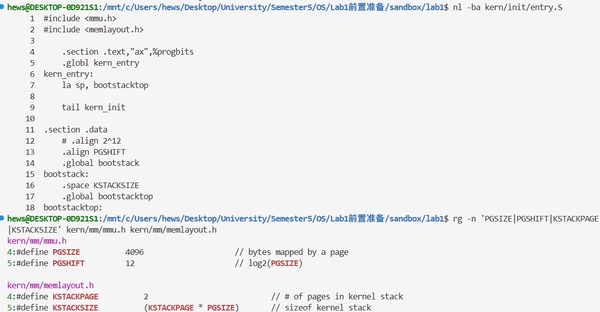

### 3.2 la sp, bootstacktop 的操作与目的

这条伪指令将启动栈顶的地址写入 SP，为接下来执行的 C 函数准备内核自己的栈。栈空间由前面的静态定义预留，la 完成的是寄存器设置。

本次反汇编为：

~~~asm
0x80200000: auipc sp,0x3
0x80200004: mv    sp,sp
0x80200008: j     0x8020000a <kern_init>
~~~

la 对应前两条机器指令。auipc 把当前 PC 加上 0x3 左移 12 位的结果，得到 0x80200000 + 0x3000 = 0x80203000；第二条 mv 是 addi sp,sp,0 的显示别名，本次低位偏移恰好为零。

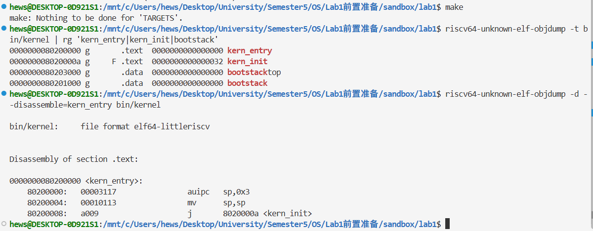

在 GDB 中，入口执行前 SP 为 0x80045e30；执行 stepi 2 后，SP 变为 0x80203000，且与 bootstacktop 的比较结果为 1。

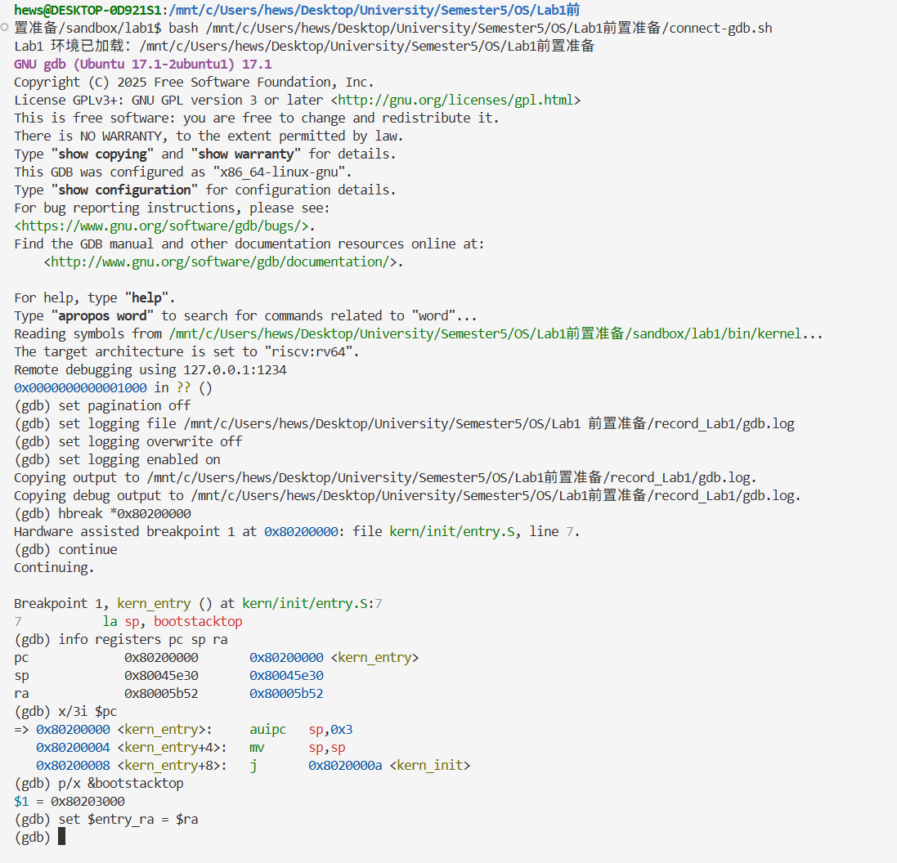

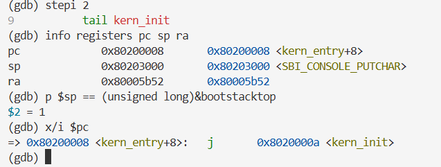

GDB 在该数值后显示 SBI_CONSOLE_PUTCHAR，是因为这个数据符号和 bootstacktop 恰好具有相同地址。栈顶地址应依据数值及与 bootstacktop 的比较确认。

### 3.3 tail kern_init 的操作与目的

tail 将控制流交给 C 初始化函数 kern_init，同时不写入新的返回地址到 RA。源码将 kern_init 声明为 noreturn，且函数末尾持续循环，因此入口没有返回需求。

本次链接器把 tail 优化为 0x80200008 处的压缩跳转，反汇编显示为 j。执行一次 stepi 后，PC 到达 0x8020000a；与 kern_init 地址一致，RA 保持 0x80005b52，比较结果为 1。

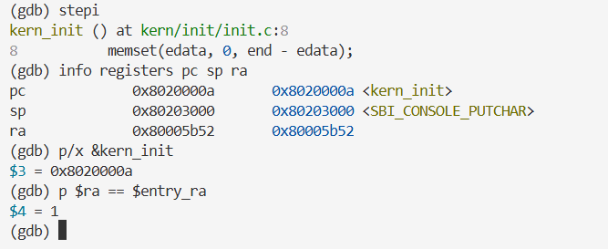

### 3.4 动态结果汇总

| 时点 | PC | SP | RA |
|---|---|---|---|
| 内核入口指令执行前 | 0x80200000 | 0x80045e30 | 0x80005b52 |
| 完成 la 对应的两条机器指令 | 0x80200008 | 0x80203000 | 0x80005b52 |
| 完成 tail | 0x8020000a | 0x80203000 | 0x80005b52 |

继续执行后，终端实际出现了内核横幅；日志还记录了主动暂停时已处在 kern_init 的持续循环中。

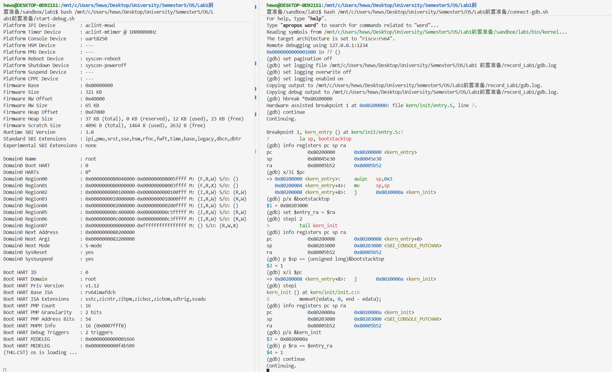

截图 1-2 的 make 输出是 Nothing to be done，表示已有构建产物无需更新。该截图不能单独证明一次从干净目录开始的完整编译过程；内核运行结果由后续调试和控制台输出支持。

## 4. 练习 2：验证启动流程

### 4.1 初始状态与六条复位指令

新启动的 QEMU 暂停时，PC 为 0x1000，SP 为 0；此时 0x80200000 已含有内核第一条指令的编码 0x00003117。

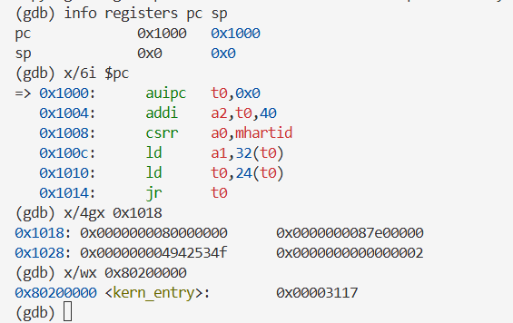

| 地址 | 指令 | 本次执行的作用 |
|---|---|---|
| 0x1000 | auipc t0,0 | t0 取得当前跳板地址 0x1000 |
| 0x1004 | addi a2,t0,40 | a2 取得启动信息地址 0x1028 |
| 0x1008 | csrr a0,mhartid | a0 取得硬件线程编号，本次为 0 |
| 0x100c | ld a1,32(t0) | 从 0x1020 读取设备树地址 0x87e00000 |
| 0x1010 | ld t0,24(t0) | 从 0x1018 读取固件入口地址 0x80000000 |
| 0x1014 | jr t0 | 跳转到固件入口 |

40、32、24 为十进制偏移。跳板后 0x1018 和 0x1020 存放固件入口与设备树地址，0x1028 起是启动信息；截图还读到了其标识和版本字段。这一复位跳板及附带数据由 QEMU 准备。[QEMU 10.2.1 对应源码](https://github.com/qemu/qemu/blob/v10.2.1/hw/riscv/boot.c)

### 4.2 从复位跳板进入 OpenSBI

先建立监视入口处 4 字节的硬件观察点，再执行 stepi 5。CPU 停在 0x1014 的 jr t0 前，寄存器结果为 t0=0x80000000、a0=0、a1=0x87e00000、a2=0x1028。

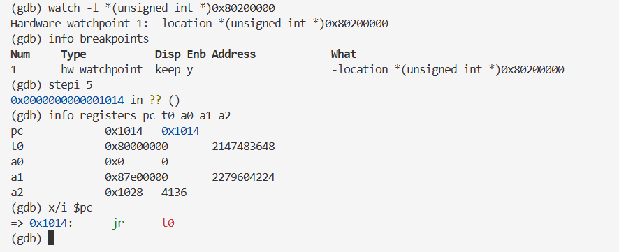

再执行一次 stepi，PC 变为 0x80000000。固件开头的前三条指令把传入参数保存到 s0/s1/s2，后面调用固件内部函数。本次未逐条单步整个固件初始化过程。

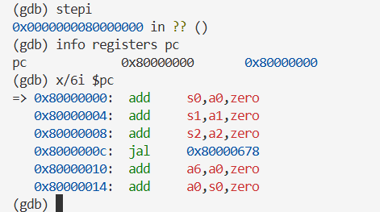

### 4.3 固件准备目标地址和权限

本次固件交接指令位于 0x80005b7a。先确认该地址确实是 mret，再设置条件硬件断点，条件为 mepc 等于 0x80200000；同时设置内核入口硬件断点。

运行到固件交接处，观察到：

~~~text
pc      = 0x80005b7a
mepc    = 0x80200000
mstatus = 0x8000000a00006800
MPP     = 1
指令    = mret
~~~

表达式 ($mstatus >> 11) & 3 取出 mstatus 的 MPP 字段。当前固件准备的是 S 模式交接状态；mret 会根据准备好的状态切换权限，并把 PC 设置为 mepc。[RISC-V 特权架构规范](https://docs.riscv.org/reference/isa/v20240411/_attachments/riscv-privileged.pdf)

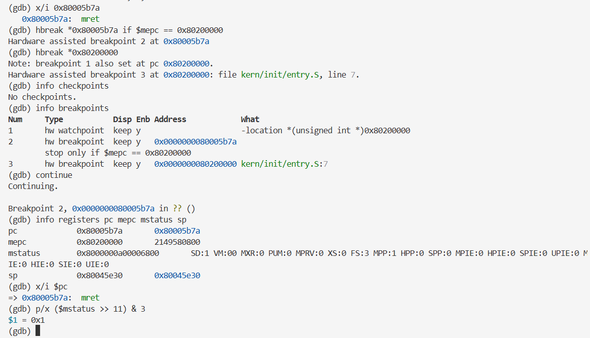

截图中的 info checkpoints 查询与本次断点检查无关；随后执行的 info breakpoints 已正确列出观察点 1 和硬件断点 2、3。

### 4.4 执行 mret 到达内核

单步执行 mret 后，触发内核入口断点 3，PC 为 0x80200000。此时内核第一条指令尚未执行，SP 仍为固件的 0x80045e30；练习 1 已验证执行 la 后才设置内核启动栈。

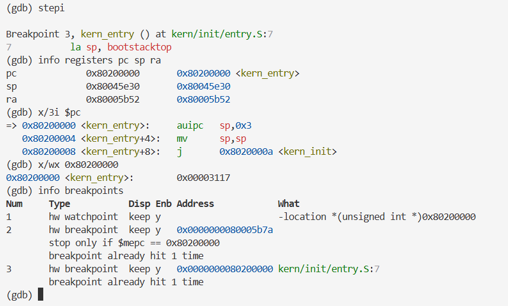

固件的串口输出同时给出 Firmware Base=0x80000000、Domain0 Next Address=0x80200000、Domain0 Next Mode=S-mode，与寄存器观察一致。

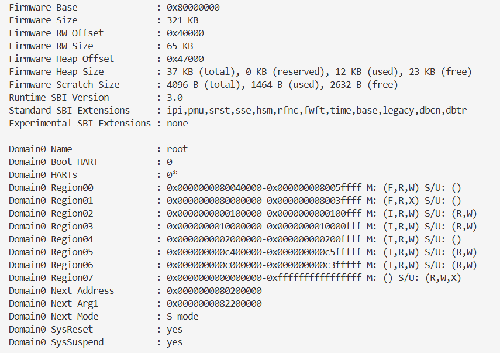

复位阶段的 a1 为 0x87e00000，固件输出的 Next Arg1 为 0x82200000，它们属于不同启动阶段。FW_JUMP 可以配置下一阶段设备树地址；这里记录相应阶段的实际数值，未额外验证设备树复制过程。[OpenSBI FW_JUMP 说明](https://github.com/riscv-software-src/opensbi/blob/master/docs/firmware/fw_jump.md)

### 4.5 观察点结果为什么符合预期

本次启动参数通过 QEMU loader 提前装入内核镜像。CPU 仍停在 0x1000 时，入口处已经有 0x00003117；进入内核时该字仍相同，观察点 1 没有触发，固件与入口执行断点各触发一次。

因此本次流程是：QEMU 先把镜像放进内存，OpenSBI 再初始化并交接执行权。[QEMU loader 文档](https://www.qemu.org/docs/master/system/generic-loader.html)

观察点只覆盖从 0x80200000 开始的 4 字节，并以数值变化为触发条件。报告应写“监视期间，入口处这 4 字节未捕获到数值变化”；该结果不能推广为整个镜像从未被写入，也不能检测保持相同数值的写入。[GDB 观察点说明](https://sourceware.org/gdb/current/onlinedocs/gdb.html/Set-Watchpoints.html)

### 4.6 实际遇到的会话问题

第一次准备练习 2 时，连接后的 PC 为 0x8020003a，当前位置是内核循环，而不是需要观察的新启动状态。退出旧 GDB/QEMU、重新启动暂停的 QEMU 后，确认 PC=0x1000、SP=0，再开始正式记录。

旧日志已放在 [diagnostics/](logs/diagnostics/exercise2-gdb.log)，成功证据使用 exercise2-reset-gdb.log 和截图 2-1 至 2-6。这样可以在报告中如实记录排查过程，避免把内核循环状态当作复位状态。

## 5. 启动主线

~~~mermaid
flowchart TD
    A["QEMU 启动准备：装入固件和内核镜像"] --> B["复位 ROM：PC = 0x1000"]
    B -->|"准备参数，jr t0"| C["OpenSBI：PC = 0x80000000"]
    C --> D["准备 mepc = 0x80200000 和目标权限"]
    D -->|"mret"| E["kern_entry：PC = 0x80200000"]
    E -->|"la sp, bootstacktop"| F["SP = 0x80203000"]
    F -->|"tail kern_init"| G["C 初始化：输出消息，持续循环"]
~~~

## 6. 复现命令

以下命令在仓库根目录执行。截图中的 start-debug.sh、connect-gdb.sh 和工具包装器位于成员本机的前置目录，未随材料导入；其他成员可用下面的标准工具命令复现。工具须支持 RISC-V RV64，FW_JUMP 路径应替换为实际安装位置。

### 6.1 构建及反汇编

~~~bash
make -C lab1
riscv64-unknown-elf-objdump -t lab1/bin/kernel | rg 'kern_entry|kern_init|bootstack'
riscv64-unknown-elf-objdump -d --disassemble=kern_entry lab1/bin/kernel
~~~

### 6.2 双终端调试

终端 A 启动 QEMU：

~~~bash
LAB1_FW_JUMP="/path/to/fw_jump.bin"
qemu-system-riscv64 -machine virt -nographic \
  -bios "$LAB1_FW_JUMP" \
  -device loader,file=lab1/bin/ucore.img,addr=0x80200000 \
  -gdb tcp:127.0.0.1:1234 -S
~~~

显式使用 FW_JUMP 与本次实验配置一致。新版默认固件可能采用 FW_DYNAMIC，不能据此假定旧式 loader 启动参数必然向它提供正确的下一阶段入口。-S 让 CPU 等待调试操作。[QEMU 调试说明](https://www.qemu.org/docs/master/system/gdb.html)

终端 B 连接：

~~~bash
riscv64-unknown-elf-gdb lab1/bin/kernel
~~~

在 GDB 中执行：

~~~gdb
set architecture riscv:rv64
target remote 127.0.0.1:1234
set pagination off
set logging file /tmp/lab1-exercises-manual-gdb.log
set logging overwrite off
set logging enabled on

info registers pc sp
x/6i $pc
x/4gx 0x1018
x/wx 0x80200000
watch -l *(unsigned int *)0x80200000

stepi 5
info registers pc t0 a0 a1 a2
x/i $pc
stepi
info registers pc
x/6i $pc
~~~

第一组寄存器检查应在 PC=0x1000 的新启动状态下进行。接下来使用本次固件交接地址；换固件后须重新定位交接处的 mret：

~~~gdb
x/i 0x80005b7a
hbreak *0x80005b7a if $mepc == 0x80200000
hbreak *0x80200000
continue
info registers pc mepc mstatus sp
x/i $pc
p/x ($mstatus >> 11) & 3

stepi
info registers pc sp ra
x/3i $pc
x/wx 0x80200000
info breakpoints
~~~

此时也可以继续验证练习 1：

~~~gdb
set $entry_ra = $ra
p/x &bootstack
p/x &bootstacktop
stepi 2
info registers pc sp ra
p $sp == (unsigned long)&bootstacktop
stepi
info registers pc sp ra
p/x &kern_init
p $ra == $entry_ra
~~~

保存截图后结束 GDB：

~~~gdb
set logging enabled off
detach
quit
~~~

detach 后 QEMU 继续运行内核；记录控制台输出，然后在终端 A 按 Ctrl+A，松开后按 x 退出。

### 6.3 校验导入材料

在仓库根目录执行以下命令，可检查导入材料是否仍与清单中的哈希一致：

~~~bash
python3 - <<'PY'
from pathlib import Path
from hashlib import sha256
import json

root = Path("lab1/report/record_Lab1")
manifest = json.loads((root / "evidence-manifest.json").read_text())
for item in manifest["files"]:
    data = (root / item["path"]).read_bytes()
    assert len(data) == item["size_bytes"], item["path"]
    assert sha256(data).hexdigest() == item["sha256"], item["path"]
print("15 份材料的大小与 SHA-256 核对通过")
PY
~~~

## 7. 用于正式报告时如何整理

| 报告部分 | 可使用的内容和证据 |
|---|---|
| 实验环境 | 第 2 节及截图 1-3；注明 virt、FW_JUMP 和实际工具版本 |
| 整体逻辑分析 | 第 5 节启动流程；区分镜像装入和 CPU 执行交接 |
| 练习 1 | 第 3 节操作与目的，配截图 1-1 至 1-5 |
| 练习 2 | 第 4 节复位、参数、mret 与观察点结论，配截图 2-1 至 2-6 |
| 运行验证 | 截图 1-6 的实际内核横幅 |
| 问题与解决 | 第 4.6 节的旧会话问题及排查日志 |
| 实验总结 | 启动分阶段交接、链接布局、栈与调用约定、权限模式、调试证据范围 |

这些材料记录的是已有启动骨架的阅读与验证。练习中没有补写内核函数；评分脚本未执行，不能把截图中的启动成功写成 make grade 通过。正式小组报告还应按课程模板补充实际分工、成员各自的 AI 使用记录和个人收获。
